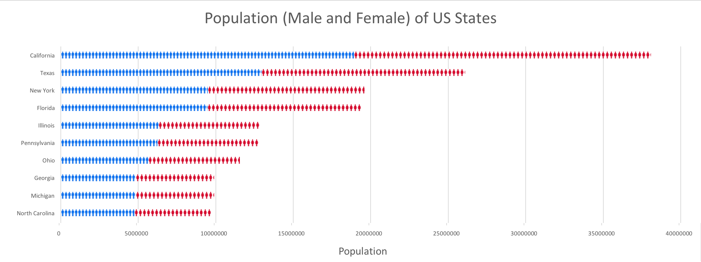
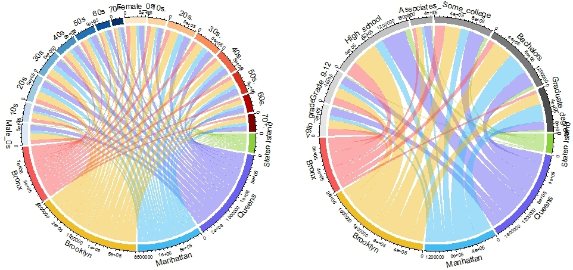
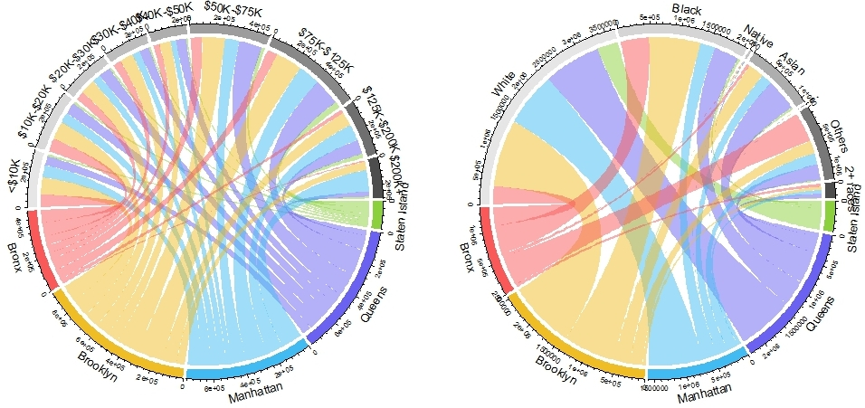
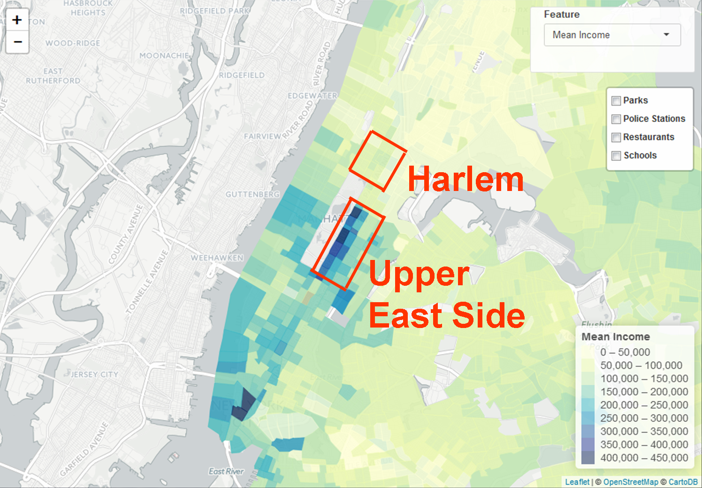

```{r, include = FALSE}
if (!require("circlize")) install.packages("circlize")
if (!require("RColorBrewer")) install.packages("RColorBrewer")
if (!require("plotly")) install.packages("plotly")
if (!require("htmlTable")) install.packages("htmlTable")
if (!require("ggplot2")) install.packages("ggplot2")
if (!require("ggmap")) install.packages("ggmap")
if (!require("gridExtra")) install.packages("gridExtra")
if (!require("ggthemes")) install.packages("ggthemes")
library("ggplot2")
library("ggmap")
library("gridExtra")
library("circlize")
library("RColorBrewer")
library("plotly")
library("reshape2")
library("plyr")
library("htmlTable")
library("ggthemes")
# setwd("C:/Users/hongzhili/Google Drive/2016 Spring/W4701 Exploratory Data Analysis and Visualization/HW3/Compile")
```

## I. Introduction

<font color="red">

[to do]

[to do]

[to do]

</font>


<center><iframe width="560" height="315" align="middle" src="https://www.youtube.com/embed/VGA6sB1nBUY" frameborder="0" allowfullscreen></iframe></center>

## II. Data

### 2.1. US Census Data Collection and Aggregation
We want to discover several features that might be useful in the application of providing personalized housing recommendation. The features we want to discover are rent, race, age, education, marital status, income, employment and occupation. The data is collected from the United States Census Bureau. They are all 2010-2014 American Community Survey 5-Year Estimates. The data is collected in two geographical scope. The large scope is in the level of states and the small scope is in the level of census tract. A series of data aggragation are performed and we finally got two files one represents the features in the scope of states (whole US) and the other represents the features in the scope of census tracts (New York City). The specific measure of each feature we are using are median rent, median_age, percentage of people with a degree of high school or higher, married ratio, median_income and unemployment rate. These features will be displayed in the following interactive maps. Categorical features like race will also be discussed later. 

### 2.2 NYC Point Data

We use point data of police stations, public schools, parks, and restaurants. These data are gotten from following data sources.

* Police stations
    * Data source is NYPD homepage ( http://www.nyc.gov/html/nypd/html/home/precincts.shtml ). This page only provides information of addresses, so we changed these addresses into latitude and logitude by using Google Maps Geocoding API. 
* Public Schools 
    * Data source is NYC open data ( https://data.cityofnewyork.us/Education/School-Point-Locations/jfju-ynrr ). This data source contains only information of addresses, so I also converted these addresses into latitude and logitude by using Google Maps Geocoding API.
* Restaurants and parks
    * Data source is Google Places API. Google Places API provides various informaiton related to places such as restaurants, bars, public facilities and so on. 
    * Google Places API provides places information around a designated area, so we walked through areas in New York City, and got information of restaurants and parks.


## III. State Level Insights of the Unite States

First of all, we would like to have a general idea about the demographic features of the United States. And then we are going to look into lower geographic levels for specific areas.

<iframe src="https://gary159.shinyapps.io/shiny2/" width="100%" height="600px" frameborder="0"></iframe>

### 3.1 Population by Gender

So here we list the top 10 states' population distribution by gender.

<center>  </center>

From the population plot, we can see that California has a overwhelming large population. The second one is Texas, and New York has a slighly larger population than Florida. We are going to focuse on New York later for our analysis.

### 3.2 Age Structure

We chose the two states Texas and Vermont to compare their age structure differences and try to figure out why Texas has the second most population while Vermont has the second least population. From the plot, we can clearly conclude that Texas has more percentages of people at each age group under 40 and less percentages of people at each age group above 50. This means that Vermont is more of an aging society which may not be a perfect place for young people to live in.     

```{r, echo=FALSE, warning=FALSE, message=FALSE, fig.width=7, fig.align='center'}
age_us = read.csv("age_s_us.csv", header = T)

age_us_state = age_us[c(44,46),c(3,7:24)]
age_us_state = melt(age_us_state, id.vars = "state")
for (i in 1:nrow(age_us_state)) {
  if (age_us_state[i,1] == "Texas")
    age_us_state[i,3] = - age_us_state[i,3]
}

age_us_state$variable = gsub("andover",">",gsub("under","<",gsub("to","-",gsub('(percentage|perenctage|\\.|years)', '',age_us_state$variable))))

age_us_state$variable = gsub("5-9","05-09",age_us_state$variable)

ggplot(age_us_state, aes(x = variable, y = value, fill = state)) + 
  geom_bar(data = subset(age_us_state, state == "Texas"), stat = "identity", aes(x = variable, y = value, fill = state)) + 
  geom_bar(data = subset(age_us_state, state == "Vermont"), stat = "identity", aes(x = variable, y = value, fill = state)) + 
  scale_y_continuous(breaks = seq(-9,9,1), labels = paste0(as.character(c(9:0,1:9)), "%")) + 
  coord_flip() + ggtitle("Population Age Structure: Texas and Vermont") +
  ylab("percentage") + xlab("age (years)") + 
  theme_fivethirtyeight() + scale_fill_tableau()
  

```

### 3.3 Education and Income

We want to analyze for each education level, which state will be of the highest median income. If you are of bachelor or higher degrees, your best choice is District of Columbia, which is not surprising. However, if your degree level is lower than high school, you may want to think about living in New Hampshire. If you are a high school graduate, Alaska has the highest median income for that degree. If you are of a college or associate degree, Maryland has the highest median income for you.      
     
<center>
```{r, echo=FALSE}
edu = read.csv("education_s_us.csv", header = T)
row_id = NULL
for(i in 14:ncol(edu)){
  row_id = c(row_id, which(edu[,i] == max(edu[,i])))
}
max_income_state = as.data.frame(as.character(edu[row_id,3]))
rownames(max_income_state) = c("overall","lower than high school","high school graduate","college or associate degree","bachelor degree","graduate or professional degree")
colnames(max_income_state) = "highest median income state"
htmlTable(max_income_state)
```
</center>

Considering most of us are of bachelor or higher degees, we want to look closer to those two degrees and see the difference of median income within each state.        

```{r, echo=FALSE, fig.width=9, fig.align='center'}
edu_higher = edu[,c(3,18,19)]
colnames(edu_higher) = c("state","bachelor","graduate or professional")
edu_higher = melt(edu_higher, id.vars = "state")
ggplot(data=edu_higher, aes(x=state, y=value, group=variable, color=variable)) +
  geom_line() + geom_point() + scale_fill_discrete(name="degree") +
  theme(legend.position="bottom") + ggtitle("Bachelor and Graduate Degree Median Income of Each State") + 
  ylab("median income")+  theme_fivethirtyeight() + scale_color_fivethirtyeight() +
  theme(axis.text.x=element_text(angle=45, vjust=1, hjust=1)) 
```

The overall trend of median income between bachelor and graduate degree within each state is basically the same. People of graduate or professional degree have significantly higher income than people of bachelor degree. For graduate or professional degree, the top five states of highest median income are District of Columbia, New Jersey, Maryland, Virginia, and California. For bachelor degree, the top five states of highest median income are District of Columbia, New Jersey, Connecticut, Maryland, Massachusetts. Sadly, New York state is at 9th position for graduate degree and 8th position for bachelor degree.     

### 3.4 Marital status and Income


We then want to analyze the marital status of four states which are two typical West Coast and East Coast States: California and New York, and two states that have the highest and lowest median income: District of Columbia and Montana. We can find out that despite of their physical distances, California and New York have very similar marital structure. Their raddar plots are almost the same. On the other hand, District of Columbia and Montana have almost the opposite marital structure. District of Columbia has an extremely high rate of never married, while Montana has a lower rate of never married but higher rate of married and divorced. So we may conclude that income may affect people's decisions about marriage.

<style>
#combined, #others {
            text-align: center;

        }

        .chart {
            background-color: #efefef;
            display: inline-block;
            margin-top: 10px;
            text-align: center;

        }
        .chart-title {
            margin-bottom: 2px;
        }
        nobr {
        	position: relative;
        	left: -115px;
        }
</style>
<script src="http://d3js.org/d3.v3.min.js"></script>
<script src="RadarChart.js"></script>
<div id="combined">
<div class="chart">
<h2>4 Typical US States</h2>
<div id="chart"></div>
</div>
</div>
<div id="others">

</div>
<script src="script_marital.js"></script>
<div style="margin-bottom:30px"></div>      


```{r, include = FALSE}
#=============#
# Circus Plot #
#=============#

# Read in all files
  # Age and Gender
  age_gender = read.csv("NYC_age_gender.csv", row.names=1)
  
  # Education
  education = read.csv("NYC_education.csv", row.names=1)
  
  # Income
  income = read.csv("NYC_income.csv", row.names=1)
  
  # Race
  race = read.csv("NYC_race.csv", row.names=1)
  
  # Cash rent
  rent_cash = read.csv("NYC_rent.csv", row.names=1)

```

## IV. County Level Insights of NYC

After analyzing the state level data, we are going to focus on the New York City area. Let's first take a look at the county level features.

There are 5 counties in the New York City: New York County (Manhattan), Kings County (Brooklyn), Queens County (Queens), Bronx County (Bronx), Richmond County (Staten Island). To be consistent with the common knowledge, we decide to use the informal county names in the following graphs.

### 4.1 Cash Rent

First, let's look at the key factor: rent price. As non-cash rent only represents about 5% of the total households, we only show the cash rent here.  The following circus plot is divided into two half spaces: the 5 county levels in the bottom half, and all cash rent ranges on the top half.  The band width represents the number of households falling into the corresponding category. 

By looking at the bottom half, we can see the general population distribution of the NYC across the 5 counties. There are the least number of households living on the Staten Island. Brooklyn and Manhattan are the two largest counties in the NYC. It is very clear that the price about 80% of the households in Bronx has a rent less than $1,500. All the other counties tend to have more balanced distributions across the rent ranges.

Then by looking at the top half, we can see that the most common rent range is $1,000-$1,499. Most of such places are in Bronx, Brooklyn and Queens. On the contrary, if we look at the $2,000+ rent range, we can see that about 2/3 of such places are in Manhattan. For the other rent ranges, there is no clear dominant county. 

This shows the fact that Manhattan is a much expensive to live in. It seems that Queens also has relatively high average rent prices. One possible reason could be that there are more married couples and families with kids living in this area than nearby counties, say Brooklyn.


<center><b>

Cash Rent by County for NYC

```{r,echo=FALSE, fig.width=5, fig.height=5}  
  # Colors
  c2 = c("#8dd03d", "#6b62f2", "#41bbf2", "#efbd26", "#f95959")
  
  # Cash rent
  data = as.matrix(rent_cash)
  colnames(data) = sub("USD_","$",colnames(data))
  colnames(data) = sub("_to_","-$",colnames(data))
  colnames(data) = sub("Less_than_","<$",colnames(data))
  colnames(data) = sub("_or_more","+",colnames(data))
  c1 = rev(gray.colors(ncol(data)))
  grid.col = NULL
  grid.col[c(colnames(data),rownames(data))] = c(c1, c2)
  chordDiagram(data, grid.col = grid.col)
```
</b></center>


### 4.2 Demographic Features
Second, we are going to analyze some other features in NYC using the same method. The following 4 circos plots show the different demographic features across the 5 counties.

The upper-left graph shows the population compositions by gender by age. It is clearly that there generally are more female than male in the NYC. Although from the previous graph of rent we know that there are a lot of households in Manhattan, on this graph we see that Manhattan is taking a smaller portion. This is because that the first 3 graphs below are based on population. Thus, it suggest the fact that there are less people living in the same house/apartment in Manhattan than the other counties.

The upper-right graph shows the education levels. Manhattan has a significantly larger portion of population with bachelor's degrees or higher. If we look at the Graduate degree category, we can see that Manhattan has more than half of the population.


<center><b>

Age by County for NYC \ \ \ \ \ \ \ \ \ \ \ \ \ \ \ \ \ \ \ \ \ \ \ \ \ \ \ \ \ \ \ \ \ \ \ \ \ \ \ \ \ \ \ \ \ \ \ \ \ \ \ \ \ \ \ \ \ \ \ \ \ \ \ \ \ Education by County for NYC

```{r,echo=FALSE, fig.width=8, fig.height=4, include = FALSE}  
  # grid
  par(mfrow = c(1,2))
  
  # Age and Gender
  data = as.matrix(age_gender)
  colnames(data) = sub("X_","",colnames(data))
  colnames(data) = sub(".1",".",colnames(data))
  colnames(data) = sub("plus","+",colnames(data))
  c11 = brewer.pal(9,"Blues")[2:9]
  c12 = brewer.pal(9,"OrRd")[2:9]
  grid.col = NULL
  grid.col[c(colnames(data),rownames(data))] = c(c11, c12, c2)
  chordDiagram(data, grid.col = grid.col)

  # Education
  data = as.matrix(education)
  colnames(data) = sub("Less_than_","<",colnames(data))
  colnames(data) = sub("_to_","-",colnames(data))
  c1 = rev(gray.colors(ncol(data)))
  grid.col = NULL
  grid.col[c(colnames(data),rownames(data))] = c(c1, c2)
  chordDiagram(data, grid.col = grid.col)
```  


Race by County for NYC \ \ \ \ \ \ \ \ \ \ \ \ \ \ \ \ \ \ \ \ \ \ \ \ \ \ \ \ \ \ \ \ \ \ \ \ \ \ \ \ \ \ \ \ \ \ \ \ \ \ \ \ \ \ \ \ \ \ \ \ \ \ \ \ \ Income by County for NYC

```{r,echo=FALSE, fig.width=10, fig.height=5, include = FALSE}  
  # grid
  par(mfrow = c(1,2))
  
  # Race
  data = as.matrix(race)
  colnames(data) = sub("X_2._","2+ ",colnames(data))
  c1 = rev(gray.colors(ncol(data)))
  grid.col = NULL
  grid.col[c(colnames(data),rownames(data))] = c(c1, c2)
  chordDiagram(data, grid.col = grid.col)
  
  # Income
  data = as.matrix(income)
  colnames(data) = sub("USD_","$",colnames(data))
  colnames(data) = sub("_to_","-$",colnames(data))
  colnames(data) = sub("Less_than_","<$",colnames(data))
  colnames(data) = sub("Over_200K","$200K+",colnames(data))
  c1 = rev(gray.colors(ncol(data)))
  grid.col = NULL
  grid.col[c(colnames(data),rownames(data))] = c(c1, c2)
  chordDiagram(data, grid.col = grid.col)
  par(mfrow = c(1,1))
```

</b></center>

The lower-left graph shows the race composition. We can see that about half of the black population live in Brooklyn; about half of the Asian population live in Queens. Except for Staten Island, other counties' population distribution pattern is generally the same as the big picture.

The lower-right graph is about annual income household.  Similar to the rent pattern, Manhattan tends to have higher numbers, while Bronx tends to have lower numbers.

The above demographic feature summaries can be very helpful when people try to decide which area to live.  We also show such information at even lower geographic levels and on the map.

## V. Census Tract Level Insights of NYC

After state and county level, we are moving to the very zoomed-in census tract level. We also have all the demographic and economic factors available at this level. Here we only show one summary graph. Then we'll show all the detailed information on the map.

The following bubble plot summarizes 4 pieces of information from the 2,101 census tracts in the NYC. The data shown here are: County Name (color), Population (size), Average Annual Income (X axis) and Median Monthly Rent (Y axis). We cut the X axis at $250,000, but we did not cut the Y axis. Because the last category of the monthly rent is "$2,800+", there are many points on the $2,800 line. We keep them there to see which areas have more expensive rents. If you'd like to ignore them, you can just zoom in or select the area that you are interested in on the graph.

<center>
```{r, echo = FALSE}

#======================#
# Census Tract Summary #
#======================#

tract = read.csv("NYC_tract.csv")

cols = rev(c("#8dd03d", "#6b62f2", "#41bbf2", "#efbd26", "#f95959"))
m = list(l = 50, r = 20, b = 50, t = 50)
plot_ly(tract, x = Income_Avg, y = Rent_Median, hoverinfo = "text", text = paste("Rent", Rent_Median, "; Income: ", Income_Avg), mode = "markers", 
        color = County, colors = cols, size = Population, marker = list(sizemode="area"))%>%
  layout(title = "Average Income vs Median Rent by Census Tract by County in NYC", titlefont=list(size=20),
         xaxis = list(title = "Average Annual Income", range = c(0,250000)), 
         yaxis = list(title = "Median Rent"),
         legend = list(x = 0.03, y = 1), margin = m)

```
</center>

From the graph above, we can clearly see that there is a positive relationship between income and rent price. Most of the census tracts from Bronx are around the lower-left corner with both low income and low rent. On the other hand, many tracts in Manhattan and Staten Island are in the upper-right area with both high income and high rent. Census tracts from Queens and Brooklyn are mostly in the center area. Brooklyn has some census tracts on the two extremes. 

## VI. Point Data Insights of NYC


```{r, include = FALSE}
ue = read.csv("restaurant_UE.csv", as.is = TRUE)
ha = read.csv("restaurant_HA.csv", as.is = TRUE)
```

After state, county and census tract level summaries, we are going to look at some of the point data we acquired in detail. Here is a map information categorized by mean income.

<center></center>

We can see the difference of income on each area. At Manhattan, the mean income is relatively high, and at some areas, the mean income is from 300,000 to 450,000. Here, we will compare the price levels of restaurants at several areas. We used restaruants information provided by Google Places API, and this API provides following price levels.

* Price level 0 : Free
* Price level 1 : Inexpensive
* Price level 2 : Moderate
* Price level 3 : Expensive
* Price level 4 : Very Expensive

We will pick up Upper East Side and Harlem. Upper East Side is an example of the area with high rent(high mean income). Harlem is an example of the area with low rent(low mean income) in Manhattan.

```{r, include=FALSE}
ue_f = data.frame(ue)
ha_f = data.frame(ha)

# average value of price level
ave_ue = mean(ue_f$price_level)
ave_ha = mean(ha_f$price_level)
```
We compare the price levels of restaurants in the Harlem area and Upper East Side in the following maps:

```{r, include=FALSE}
### map drawing
# harlem
map_nyc_ha <- get_googlemap(center = c(lon=-73.937571, lat=40.804670), maptype = "satellite", zoom = 15)
# upper east
map_nyc_ue <- get_googlemap(center = c(lon=-73.960927, lat=40.771333), maptype = "satellite", zoom = 15)
```
<center>
```{r, message=FALSE,warning=FALSE,echo=FALSE, fig.width=9, fig.height=4}
gha <- ggmap(map_nyc_ha, extent = "device") + 
  geom_jitter(data=ha_f, aes(lng, lat, color = price_level, size = 5), alpha = 0.5) +
  scale_colour_gradientn(colours = rainbow(2, start = 0.15, alpha = 0.5)) +
  labs(title = "Price level of restaurants in Harlem", color = "Price level", size = "Location") 

gue <- ggmap(map_nyc_ue, extent = "device") + 
  geom_jitter(data=ue_f, aes(lng, lat, color = price_level, size = 5), alpha = 0.5) +
  scale_colour_gradientn(colours = rainbow(3, start = 0.15, alpha = 0.5)) +
  labs(title = "Price level of restaurants in Upper East Side", color = "Price level", size = "Location")
grid.arrange(gha,gue, nrow=1)
```
</center>

As we can see that in the map on the left-hand side (Harlem), the price level of restaurants at this area are relatively low. There is no restaurants which have price level 4. Most restaurants have price level 1. The average price level of restaurants at Harlem is `r ave_ha`.

On the contrary, in the map on the right-hand side (Upper East Side), the price levels of restaurants are relatively high. We can see that some restaurants have over price level 3. Even in Upper East Side area, there are some restaurants with price level 1. This is because chain restaurants such as Subway and Dunkin' Donuts are also located in Upper East Side. The average price level of restaurants at Upper East Side is `r ave_ue`.


## VII. NYC Interactive Maps

<font color="red">[to do]</font>


<iframe src="https://carlosespino11.shinyapps.io/nyc-features/" width="100%" height="600px" frameborder="0"></iframe>

<font color="red">[to do]</font>


## VIII. Summary

<font color="red">

[to do]

[to do]

[to do]

</font>

