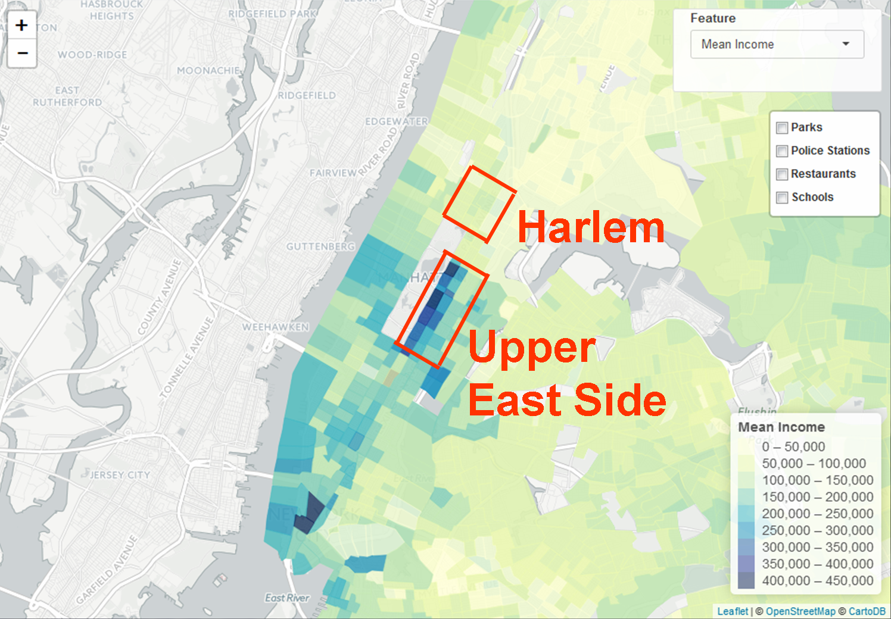

```{r, include=FALSE}
setwd("C:\\Users\\HS\\Desktop\\school\\classes\\VIS\\HW3\\git3\\Edav-P3-ggteam\\hs2865")

library(ggplot2)
library(ggmap)

ue = read.csv("restaurant_UE.csv", as.is = TRUE)
ha = read.csv("restaurant_HA.csv", as.is = TRUE)
```

## Details of Point data
We use point data of police stations, public schools, parks, and restaurants. These data are gotten from following data sources.

* Police stations
    * NYPD homepage ( http://www.nyc.gov/html/nypd/html/home/precincts.shtml )
* Public Schools 
    * NYC open data ( https://data.cityofnewyork.us/Education/School-Point-Locations/jfju-ynrr )
* Restaurants
    * Google Places API
* Parks
    * Google Places API

## Specific examples of restaurants

Here is a map information categorized by mean income.



We can see the difference of income on each area. At Manhattan, the mean income is relatively high, and at some areas, the mean income is from 300,000 to 450,000. Here, we will compare the price levels of restaurants at several areas. We used restaruants information provided by Google Places API, and this API provides following price levels.

* Price level 0 : Free
* Price level 1 : Inexpensive
* Price level 2 : Moderate
* Price level 3 : Expensive
* Price level 4 : Very Expensive

We will pick up Upper East Side and Harlem. Upper East Side is an example of the area with high rent(high mean income). Harlem is an example of the area with low rent(low mean income) in Manhattan.

```{r, include=FALSE}
ue_f = data.frame(ue)
ha_f = data.frame(ha)

# average value of price level
ave_ue = mean(ue_f$price_level)
ave_ha = mean(ha_f$price_level)
```

Here is a map with price level of restaurants in Harlem area. 
```{r, include=FALSE}
### map drawing
# harlem
map_nyc_ha <- get_googlemap(center = c(lon=-73.937571, lat=40.804670), maptype = "satellite", zoom = 15)
```
```{r, message=FALSE,warning=FALSE}
ggmap(map_nyc_ha, extent = "device") + 
  geom_jitter(data=ha_f, aes(lng, lat, color = price_level, size = 5), alpha = 0.5) +
  scale_colour_gradientn(colours = rainbow(2, start = 0.15, alpha = 0.5)) +
  labs(title = "Price level of restaurants in Harlem", color = "Price level", size = "Location")
```

As we can see at the map above, price level of restaurants at this area are relatively low. There is no restaurants which have price level 4. Most restaurants have price level 1. The average price level of restaurants at Harlem is `r ave_ha`.


Here is a map with price level of restaurants in Upper East Side area. 
```{r, include=FALSE}
# upper east
map_nyc_ue <- get_googlemap(center = c(lon=-73.960927, lat=40.771333), maptype = "satellite", zoom = 15)
```
```{r, message=FALSE,warning=FALSE}
ggmap(map_nyc_ue, extent = "device") + 
  geom_jitter(data=ue_f, aes(lng, lat, color = price_level, size = 5), alpha = 0.5) +
  scale_colour_gradientn(colours = rainbow(3, start = 0.15, alpha = 0.5)) +
  labs(title = "Price level of restaurants in Upper East Side", color = "Price level", size = "Location")
```

As we can see at the map above, price level of restaurants at this area are relatively high. We can see that some restaurants have over price level 3. Even in Upper East Side area, there are some restaurants with price level 1. This is because chain restaurants such as Subway and Dunkin' Donuts are also located in Upper East Side. The average price level of restaurants at Upper East Side is `r ave_ue`.
