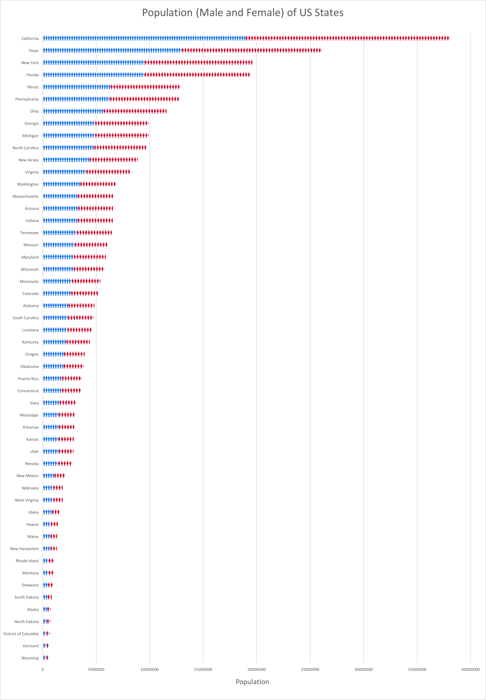

```{r, echo=FALSE}
library(ggplot2)
library(reshape2)
library(plyr)
setwd("/Users/qitong/GitHub/edav_3/ql2257")
```

  

From the population plot, we can see that California has a overwhelming large population. The second one is Texas, and New York has a slighly larger population than Florida.

```{r, echo=FALSE, warning=FALSE, message=FALSE, fig.width=10}
age_us = read.csv("age_s_us.csv", header = T)

age_us_state = age_us[c(44,46),c(3,7:24)]
age_us_state = melt(age_us_state, id.vars = "state")
for (i in 1:nrow(age_us_state)) {
  if (age_us_state[i,1] == "Texas")
    age_us_state[i,3] = - age_us_state[i,3]
}

ggplot(age_us_state, aes(x = variable, y = value, fill = state)) + 
  geom_bar(subset = .(state == "Texas"), stat = "identity") + 
  geom_bar(subset = .(state == "Vermont"), stat = "identity") + 
  scale_y_continuous(breaks = seq(-9,9,1), 
                     labels = paste0(as.character(c(9:0,1:9)), "%")) + 
  coord_flip() + ggtitle("Population Age Structure between Texas and Vermont") +
  ylab("percentage") + xlab("age")
```

We chose the two states Texas and Vermont to compare their age structure differences and try to figure out why Texas has the second most population while Vermont has the second least population. From the plot, we can clearly conclude that Texas has more percentages of people at each age group under 40 and less percentages of people at each age group above 50. This means that Vermont is more of an aging society which may not be a perfect place for young people to live in.          

```{r, echo=FALSE}
edu = read.csv("education_s_us.csv", header = T)
row_id = NULL
for(i in 14:ncol(edu)){
  row_id = c(row_id, which(edu[,i] == max(edu[,i])))
}
max_income_state = as.data.frame(as.character(edu[row_id,3]))
rownames(max_income_state) = c("overall","lower than high school","high school graduate","college or associate degree","bachelor degree","graduate or professional degree")
colnames(max_income_state) = "highest median income state"
max_income_state
```

We want to analyze for each education level, which state will be of the highest median income. If you are of bachelor or higher degrees, your best choice is District of Columbia, which is not surprising. However, if your degree level is lower than high school, you may want to think about living in New Hampshire. If you are a high school graduate, Alaska has the highest median income for that degree. If you are of a college or associate degree, Maryland has the highest median income for you.      

Considering most of us are of bachelor or higher degees, we want to look closer to those two degrees and see the difference of median income within each state.        

```{r, echo=FALSE, fig.width=10}
edu_higher = edu[,c(3,18,19)]
colnames(edu_higher) = c("state","bachelor","graduate or professional")
edu_higher = melt(edu_higher, id.vars = "state")
ggplot(data=edu_higher, aes(x=state, y=value, group=variable, color=variable)) +
  geom_line() + geom_point() + scale_fill_discrete(name="degree") +
  theme(legend.position="bottom") + ggtitle("Bachelor and Graduate Degree Median Income of Each State") + theme(axis.text.x=element_text(angle=45, vjust=1, hjust=1)) + 
  ylab("median income")
```

The overall trend of median income between bachelor and graduate degree within each state is basically the same. People of graduate or professional degree have significantly higher income than people of bachelor degree. For graduate or professional degree, the top five states of highest median income are District of Columbia, New Jersey, Maryland, Virginia, and California. For bachelor degree, the top five states of highest median income are District of Columbia, New Jersey, Connecticut, Maryland, Massachusetts. Sadly, New York state is at 9th position for graduate degree and 8th position for bachelor degree.     

We then want to analyze the marital status of four states which are two typical West Coast and East Coast States: California and New York, and two states that have the highest and lowest median income: District of Columbia and Montana. We can find out that despite of their physical distances, California and New York have very similar marital structure. Their raddar plots are almost the same. On the other hand, District of Columbia and Montana have almost the opposite marital structure. District of Columbia has an extremely high rate of never married, while Montana has a lower rate of never married but higher rate of married and divorced. So we may conclude that income may affect people's decisions about marriage.

<style>
#combined, #others {
            text-align: center;

        }

        .chart {
            background-color: #efefef;
            display: inline-block;
            margin-top: 10px;
            text-align: center;

        }
        .chart-title {
            margin-bottom: 2px;
        }
        nobr {
        	position: relative;
        	left: -115px;
        }
</style>
<script src="http://d3js.org/d3.v3.min.js"></script>
<script src="RadarChart.js"></script>
<div id="combined">
<div class="chart">
<h2>4 Typical US States</h2>
<div id="chart"></div>
</div>
</div>
<div id="others">
<nobr>
<div class="chart">
<h2 class="chart-title">California</h2>
<div id="chart1"></div>
</div>
<div class="chart">
<h2 class="chart-title">District of Columbia</h2>
<div id="chart2"></div>
</div>
</nobr>
<nobr>
<div class="chart">
<h2 class="chart-title">New York</h2>
<div class="chart" id="chart3"></div>
</div>

<div class="chart">
<h2 class="chart-title">Montana</h2>
<div class="chart" id="chart4"></div>
</div>
</nobr>
</div>
<script src="script_marital.js"></script>
<div style="margin-bottom:30px"></div>      


```{r,echo=FALSE, fig.width=10, fig.height=12}
race = read.csv("race_s_us.csv", header = T)
for(i in 5:8){
  race[,i] = race[,i] / race[,4]
}
race = race[,-c(1,2,4)]
race = melt(race, id.vars = "State")

ggplot(race, aes(x=State, y=value, fill=variable)) + geom_bar(stat = "identity", color="white") + coord_flip() + theme(legend.position="bottom") + ggtitle("Race Composition of US States") + scale_y_continuous(expand = c(0,0),limits = c(0,1)) + scale_fill_discrete(name="race")
```

We can see that white people are the majorities in most states except Hawaii and District of Columbia. African American people make up a larget part of District Columbia. Hawaii has the most percentage of Asian people while Puerto Rico on the opposite has the least.
